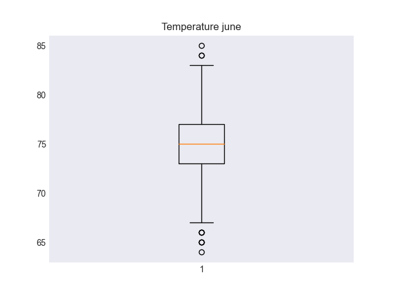
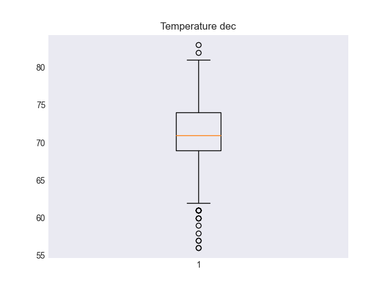

- [Weather Analysis](#orgfbeaa32)
  - [Overview of the analysis](#orgaefc823)
  - [Results](#org72a7b88)
    - [Result: Boilerplate Base](#org9e7efa9)
    - [Result: Functional Filter](#orgcf84068)
    - [Result: Data Description](#orgff49abf)
  - [Summary](#org46b26db)


<a id="orgfbeaa32"></a>

# Weather Analysis


<a id="orgaefc823"></a>

## Overview of the analysis

We managed to get a good understanding of our data by filtering it and summarizing it, but we would like to get another look at specific dates in order to provide more solutions for our client.

That is why we went into the database once more and fetched summaries of Temperatures from June and December.


<a id="org72a7b88"></a>

## Results

We achieved the following results:

1.  We put together the boilerplate code for the basis of any sql query from python we could need.
2.  We made functions that abstract specific steps from the data filtering and organization for later use.
3.  We got the summaries that the client wanted.


<a id="org9e7efa9"></a>

### Result: Boilerplate Base

One of the most useful stages in the project was stablishing a base for all our future `Python-SQL` code. Where we can set our classes and sessions to deal with whatever the client asks for.

<div class="src-name" id="orgb1c70e7">
<p>

</p>

</div>

```python
from sqlalchemy.ext.automap import automap_base
from sqlalchemy.orm import Session
from sqlalchemy import create_engine, func
import pandas as pd

engine = create_engine("sqlite:///hawaii.sqlite")
Base = automap_base()
Base.prepare(engine, reflect=True)

# Database specific
Measurement = Base.classes.measurement
Station = Base.classes.station
session = Session(engine)
for col in Measurement.__table__.columns:
    print(col.key)
```

    id
    station
    date
    prcp
    tobs


<a id="orgcf84068"></a>

### Result: Functional Filter

We were able to use the `func.strftime` function from `sqlalchemy` to deal with dates, then wrap the process in a function we can use for all the different queries we want.

<div class="src-name" id="orgd5be248">
<p>

</p>

</div>

```python
def get_temperature_by_date(date: str, frmt: str, name: str) -> pd.DataFrame:
    """Get all temperature values filtered by date.

    Args:
        date (str): Date, day, month, etc.
        frmt (str): Format, %d, %m, etc
        name (str): Date name, for df column.

    Returns:
        pd.DataFrame: Results as Dataframe, from list of single values (not tuples).
    """
    return pd.DataFrame(
        [
            i[0] for i in (
                session
                .query(Measurement.tobs)
                .filter(func.strftime(frmt, Measurement.date) == date)
                .all()
            )
         ],
        columns=[f'Temps {name}']
    )
print(get_temperature_by_date)
```

    <function get_temperature_by_date at 0x11618ac20>


<a id="orgff49abf"></a>

### Result: Data Description

Now that we have our function we can use it to get the summaries we need.

<div class="src-name" id="org57945c3">
<p>

</p>

</div>

```python
june = get_temperature_by_date("06", "%m", "June")
print(june.describe())
```

<table><tr><th>        Temps June</th></tr><tr><td>count  1700.000000</td></tr><tr><td>mean     74.944118</td></tr><tr><td>std       3.257417</td></tr><tr><td>min      64.000000</td></tr><tr><td>25%      73.000000</td></tr><tr><td>50%      75.000000</td></tr><tr><td>75%      77.000000</td></tr></table>

And the result from December.

<div class="src-name" id="org3a0ea69">
<p>

</p>

</div>

```python
december = get_temperature_by_date("12", "%m", "December")
print(december.describe())
```

<table><tr><th>       Temps December</th></tr><tr><td>count     1517.000000</td></tr><tr><td>mean        71.041529</td></tr><tr><td>std          3.745920</td></tr><tr><td>min         56.000000</td></tr><tr><td>25%         69.000000</td></tr><tr><td>50%         71.000000</td></tr><tr><td>75%         74.000000</td></tr></table>

We can also make a few plots out of the results.

<div class="src-name" id="org2b1706b">
<p>

</p>

</div>

```python
import matplotlib.pyplot as plt

plt.style.use("seaborn-dark")
files = ["temp_june.png", "temp_dec.png"]
dfs = [june, december]
for f, df in zip(files, dfs):
    plt.boxplot(df)
    plt.title(f"Temperature {f.replace('temp_', '').replace('.png', '')}")
    plt.savefig(f)
    plt.close()
print(files)
```

<div class="org" id="orgcc8358b">

<div id="orgc8c833b" class="figure">
<p>
</p>
</div>


<div id="org486cd9d" class="figure">
<p>
</p>
</div>

</div>


<a id="org46b26db"></a>

## Summary

Once we did the initial work of sorting out how to access, filter and transform the data, we made long strides without much effort in the following iterations of our process.

This shows how a programming language like Python goes so well together with SQL as it allows us to automate repetitive tasks that may vary only a little.

Splitting the work into designing our process and the process itself really helps on focusing in the data whenever we are working with it instead of having to deal with the &ldquo;how&rdquo; we are dealing with it.
